# 机器学习与数据挖掘作业 1

## 1 SVM 模型的一般理论

### 1.1 软线性最大间隔分类器

* 对线性不可分的训练数据使用线性分类器，将无法找出用于划分类别的超平面。为了解决这个问题，我们把约束条件放松为

    $$
    y^{(n)} \cdot\left(\boldsymbol{w}^{T} \boldsymbol{x}^{(n)}+b\right) \geq 1-\xi_{n}
    $$

    其中，$\xi_n\ge0$ 是松弛变量。

    目标函数变为

    $$
    \frac{1}{2}\|w\|^{2}+C \sum_{n=1}^{N} \xi_{n}
    $$

    其中，$C$ 用来控制相对重要性。

* 现在，优化问题变为

	$$
	\begin{aligned}
	&\min _{\boldsymbol{w}, b, \xi} \frac{1}{2}\|\boldsymbol{w}\|^{2}+C \sum_{n=1}^{N} \xi_{n} \\
	&\quad\text {s.t.: } y^{(n)} \cdot\left(\boldsymbol{w}^{T} \boldsymbol{x}^{(n)}+b\right) \geq 1-\xi_{n} \\
	&\quad\quad\quad\xi_{n} \geq 0, \quad \text { for } n=1,2, \cdots, N
	\end{aligned}
	$$

* 对偶问题为

	$$
	\begin{array}{l}
	\max _{\boldsymbol{a}} g(\boldsymbol{a})\\
	\text { s.t.: } a_{n} \geq 0, a_{n} \leq C\\
	\quad\quad\sum_{n=1}^{N} a_{n} y^{(n)}=0
	\end{array}
	$$

	其中，$g(\boldsymbol{a})=\sum_{n=1}^{N} a_{n}-\frac{1}{2} \sum_{n=1}^{N} \sum_{m=1}^{N} a_{n} a_{m} y^{(n)} y^{(m)} \boldsymbol{x}^{(n) T} \boldsymbol{x}^{(m)}$

* 得到最优的 $\boldsymbol{x}^*$ 和 $b^*$ 后，样本 $\boldsymbol{x}$ 可以这样分类

	$$
	\hat{y}(\boldsymbol{x})=\operatorname{sign}\left(\boldsymbol{w}^{* T} \boldsymbol{x}+b^{*}\right)
	$$

* 得到最优的 $\boldsymbol{a}^*$ 后，样本 $\boldsymbol{x}$ 可以这样分类

	$$
	\hat{y}(x)=\operatorname{sign}\left(\sum_{n=1}^{N} a_{n}^{*} y^{(n)} x^{(n) T} x+b^{*}\right)
	$$

	同样地，$\boldsymbol{a}^*$ 是稀疏的，只有位于间隔内的元素非 0。

###  1.2 非线性化

* 以上讨论的最大间隔分类器都是线性的。

* 为了使模型非线性化，我们通过一个基函数 $\phi$ 把原始数据 $x$ 映射到特征空间，那么最初的最大间隔优化问题变成

	$$
	\begin{aligned}
	&\min _{\boldsymbol{w}, b, \xi} \frac{1}{2}\|\boldsymbol{w}\|^{2}+C \sum_{n=1}^{N} \xi_{n} \\
	&\quad\text {s.t.: } y^{(n)} \cdot\left(\boldsymbol{w}^{T} \boldsymbol{\phi}(\boldsymbol{x}^{(n)})+b\right) \geq 1-\xi_{n} \\
	&\quad\quad\quad\xi_{n} \geq 0, \quad \text { for } n=1,2, \cdots, N
	\end{aligned}
	$$

	分类器：$\hat{y}(\boldsymbol x)=s i g n{\bigl(}\boldsymbol w^{*T}\boldsymbol\phi{\bigl(}\boldsymbol x^{(n)}{\bigr)}+b^{*}{\bigr)}$

* 直觉上，数据在高维空间中更容易分类，所以为了得到更好的分类效果，我们希望特征空间的维度越高越好。然而，如果基函数 $\phi(\boldsymbol x)$ 的维度过高，主优化问题会非常难解，但是我们可以通过它的对偶问题来求解：

	$$
	\begin{aligned}
	\max _{\boldsymbol{a}} g(\boldsymbol{a}) & \\
	\text { s.t.: } & a_{n} \geq 0, a_{n} \leq C \\
	& \sum_{n=1}^{N} a_{n} y^{(n)}=0
	\end{aligned}
	$$

	其中，$g(\boldsymbol{a})=\sum_{n=1}^{N} a_{n}-\frac{1}{2} \sum_{n=1}^{N} \sum_{m=1}^{N} a_{n} a_{m} y^{(n)} y^{(m)} \phi\left(x^{(n)}\right)^{T} \phi\left(x^{(m)}\right)$

	分类器：
	$$
	\hat y(\boldsymbol x)=sign\left (\sum_{n=1}^Na_n^*y^{(n)}\boldsymbol \phi(\boldsymbol x^{(n)})^T\boldsymbol\phi(\boldsymbol x)+b^*\right )
	$$
	但是对偶公式需要计算 $\phi(x^{(n)})^{T}\phi(x)$，这在高维空间很难计算。这个问题可以使用 kernel trick 解决。

### 1.3 核函数

* 核函数：能够表达为某个函数的内积的双变量函数：

	$$
	k(\boldsymbol x, \boldsymbol x')=\boldsymbol\phi(\boldsymbol x)^T\boldsymbol\phi(\boldsymbol x')
	$$

* Mercer 定理：

	如果一个函数 $k(\boldsymbol x, \boldsymbol x')$ 是对称正定的，即

	$$
	\iint g(\boldsymbol{x}) k(\boldsymbol{x}, \boldsymbol{y}) g(\boldsymbol{y}) d \boldsymbol{x} d \boldsymbol{y} \geq 0, \quad \forall g(\cdot) \in L^{2}
	$$

	那么一定存在一个函数 $\boldsymbol{\phi}(\cdot)$ 使得 $k(\boldsymbol x, \boldsymbol x')=\boldsymbol\phi(\boldsymbol x)^T\boldsymbol\phi(\boldsymbol x')$。

	即：如果一个函数 $k(\boldsymbol x, \boldsymbol x')$ 满足对称正定条件，那么它一定是一个核函数。

* 一个最常使用的核函数是**高斯核函数**：

	$$
	k\left(x, x^{\prime}\right)=\exp \left\{-\frac{1}{2 \sigma^{2}}\left\|x-x^{\prime}\right\|^{2}\right\}
	$$

	高斯核的 $\boldsymbol{\phi(\cdot)}$ 有无穷维：

	$$
	\phi(x)=e^{-x^{2} / 2 \sigma^{2}}\left[1, \sqrt{\frac{1}{1 ! \sigma^{2}}} x, \sqrt{\frac{1}{2 ! \sigma^{4}}} x^{2}, \sqrt{\frac{1}{3 ! \sigma^{6}}} x^{3}, \cdots\right]^{T}
	$$

### 1.4 Kernel Trick

* Kernel trick：使用核函数 $k(\boldsymbol x, \boldsymbol x')$ 代替 $\boldsymbol\phi(\boldsymbol x)^T\boldsymbol\phi(\boldsymbol x')$

* 有了核函数，对偶最大化间隔分类器的优化问题可以写成

	$$
	\begin{aligned}
	\max _{\boldsymbol{a}} g(\boldsymbol{a}) & \\
	\text { s.t.: } & a_{n} \geq 0, a_{n} \leq C \\
	& \sum_{n=1}^{N} a_{n} y^{(n)}=0
	\end{aligned}
	$$

	其中，$g(\boldsymbol{a})={\sum_{n=1}^{N} a_{n}-\frac{1}{2} \sum_{n=1}^{N} \sum_{m=1}^{N} a_{n} a_{m} y^{(n)} y^{(m)} k\left (\boldsymbol x^{(n)}, \boldsymbol{x} ^{(m)} \right )}$

* 分类器：

	$$
	\hat{y}(\boldsymbol{x})=\operatorname{sign}\left(\sum_{n=1}^{N} a_{n}^{*} y^{(n)} k\left(x^{(n)}, x\right)+b^{*}\right)
	$$

## 2 采用不同核函数的模型和性能比较及分析

* 性能比较：

    | 核函数类型 | 训练集准确率 | 测试集准确率 | 训练用时 |
    | ---------- | ------------ | ------------ | -------- |
    | 线性核函数 | 100.000%     | 99.858%      | 0.4403 s |
    | 高斯核函数 | 99.931 %     | 99.995%      | 0.8135 s |

* 分析：

    * 使用线性核函数 $k(\boldsymbol{x},\boldsymbol{x}')=\boldsymbol{x}^T\boldsymbol{x}'$ 的 SVM 退化为一个线性最大间隔分类器，而使用高斯核函数 $k\left(x, x^{\prime}\right)=\exp \left\{-\frac{1}{2 \sigma^{2}}\left\|x-x^{\prime}\right\|^{2}\right\}$ 的 SVM 可以看作一个无穷维的非线性最大间隔分类器。因此使用高斯核函数的 SVM 对于非线性数据的分类能力强于使用线性核函数的 SVM。
    * 从训练用时上看，由于高斯核函数比线性核函数复杂很多，因此使用高斯核函数的 SVM 训练耗时也远多于使用线性核函数的 SVM。

## 3 采⽤ hinge loss 的线性分类模型和 SVM 模型之间的关系

SVM 相当于在采用 hinge loss 的软线性最大间隔分类器的基础上使用 kernel trick 使其非线性化。

使用 hinge loss 的线性分类模型对应的优化问题的对偶问题为：
$$
	\begin{array}{l}
	\max _{\boldsymbol{a}} g(\boldsymbol{a})\\
	\text { s.t.: } a_{n} \geq 0, a_{n} \leq C\\
	\quad\quad\sum_{n=1}^{N} a_{n} y^{(n)}=0
	\end{array}
	
$$
其中，$g(\boldsymbol{a})=\sum_{n=1}^{N} a_{n}-\frac{1}{2} \sum_{n=1}^{N} \sum_{m=1}^{N} a_{n} a_{m} y^{(n)} y^{(m)} \boldsymbol{x}^{(n) T} \boldsymbol{x}^{(m)}$

为了使模型非线性化，使用一个基函数 $\phi$ 把原始数据 $x$ 映射到特征空间：
$$
g(\boldsymbol{a})={\sum_{n=1}^{N} a_{n}-\frac{1}{2} \sum_{n=1}^{N} \sum_{m=1}^{N} a_{n} a_{m} y^{(n)} y^{(m)} \phi\left(x^{(n)}\right)^{T} \phi\left(x^{(m)}\right)}
$$
而 SVM（使用了 kernel trick）的优化问题中：
$$
g(\boldsymbol{a})={\sum_{n=1}^{N} a_{n}-\frac{1}{2} \sum_{n=1}^{N} \sum_{m=1}^{N} a_{n} a_{m} y^{(n)} y^{(m)} k\left (\boldsymbol x^{(n)}, \boldsymbol{x} ^{(m)} \right )}
$$

## 4 采⽤ hinge loss 线性分类模型和 cross-entropy loss 线性分类模型⽐较

* 模型比较

    * cross-entropy loss 线性分类模型的损失函数：
        $$
        	\begin{aligned}
        	L(w, b) &=-\sum_{n=1}^{N}\left[\tilde{y}^{(n)} \log \sigma\left(h^{(n)}\right)+\left(1-\tilde{y}^{(n)}\right)\left(1-\sigma\left(h^{(n)}\right)\right)\right]+\lambda\|w\|^{2} \\
        	&=\sum_{n=1}^{N} \log \left(1+\exp \left(-y^{(n)} h^{(n)}\right)\right)+\lambda\|w\|^{2} \\
        	&=\sum_{n=1}^{N} E_{L R}\left(y^{(n)} h^{(n)}\right)+\lambda\|w\|^{2}
        	\end{aligned}
        	
        $$
        其中，$E_{LR}(z)=\log(1+\exp(-z))$，$\tilde y\in\{0,1\}$，$y\in\{-1.1\}$

    * hinge loss 线性分类模型的损失函数：
        $$
        	\begin{aligned}
        	L(\boldsymbol{w}, b) &=C \sum_{n=1}^{N} E_{S V}\left(y^{(n)} h^{(n)}\right)+\frac{1}{2}\|\boldsymbol{w}\|^{2} \\
        	&=\sum_{n=1}^{N} E_{S V}\left(y^{(n)} h^{(n)}\right)+\lambda\|\boldsymbol{w}\|^{2}
        	\end{aligned}
        	
        $$
        其中，$E_{SV}(z)=\max(0,1-z)$。

    * 两者的损失函数具有相同的形式，而只有一部分不同。

* 性能比较：

    | 损失函数类型       | 训练集准确率 | 测试集准确率 | 训练用时 |
    | ------------------ | ------------ | ------------ | -------- |
    | cross-entropy loss | 99.961%      | 99.905%      | 9.92s    |
    | hinge loss         | 99.990 %     | 99.905%      | 9.95s    |

    在本次实验中，两个模型的性能相似。

## 5 训练过程

### 5.1 数据预处理

本次实验要解决的是手写数字 0 和 1 的识别问题，标签为 0 和 1 两种，而输入高达 784 维，每个维度的数据在 0-255 之间。如果不对数据进行处理，会导致线性分类模型的损失值非常大甚至溢出，并且高斯核函数的 SVM 收敛非常慢。

我最初使用归一化的方法处理数据，即对训练集中每个维度的数据，求出其最小值 $min$ 和最大值 $max$，然后归一化每个数据 $x'={x-min\over max-min}$。但是这么处理之后，我发现有的属性在训练集中所有数据都为 0，所以最大值和最小值都是 0，这样做会导致除以 0 的问题。虽然我们可以在分母上加上一个非常小的数来避免除以 0 的错误，但是如果测试集中有的数据在这个属性上的值非 0，除以一个很小的数字会导致这个数变得很大，影响模型的判断。同理，如果使用标准化来处理数据，也会存在这个问题。

因此，我根据所有数据都在 0-255 之间的特性，通过以下公式将所有数据映射到 $[-1,1]$：
$$
x'={2x\over255}-1
$$

### 5.2 初始化方法

使用服从均值为 0 标准差为 1 的正态分布的随机值初始化线性分类器的参数。

### 5.3 超参数选择

首先将训练数据划分为 4:1 的两部分，第一部分作为训练集用来训练模型，第二部分作为验证集用来调整超参数。本实验使用梯度下降的方法来优化线性分类模型，需要调整的超参数有学习率、epoch 和 batch size。batch size 主要影响模型损失下降的平滑程度和模型收敛的时间效率，还需要考虑机器的计算性能进行设置，在本实验中将其固定为 32。下面我们主要考虑学习率和 epoch 的选择。

#### 5.3.1 使用 hinge loss 的线性分类器

| 学习率 |                           损失曲线                           | 准确率曲线                                                   | 验证集准确率最高值及对应的 epoch |
| :----: | :----------------------------------------------------------: | ------------------------------------------------------------ | :------------------------------: |
| 0.001  | 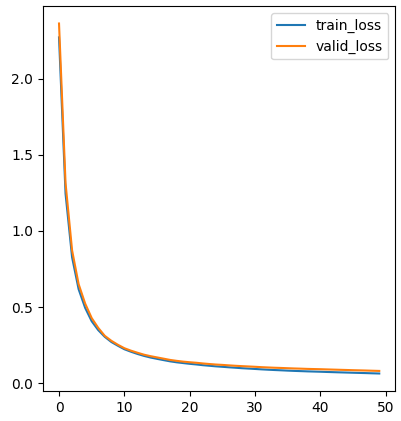 | 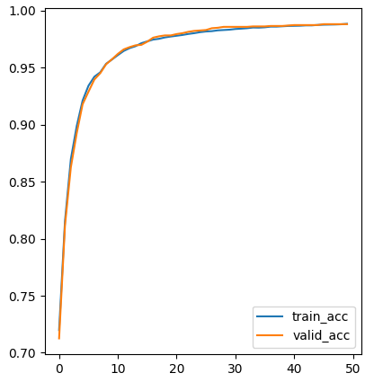 |     98.82% （epoch46）      |
|  0.01  | 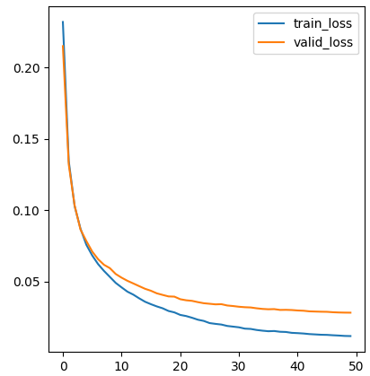 | 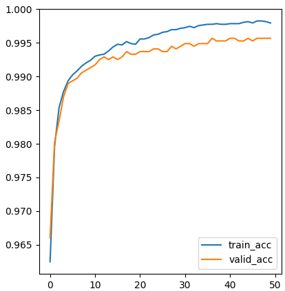 |     99.57% （epoch37）      |
|  0.1   | 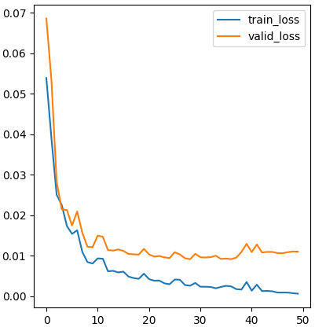 | 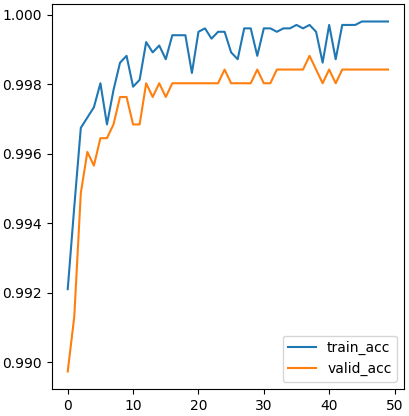 |     99.88% （epoch38）      |
|   1    | 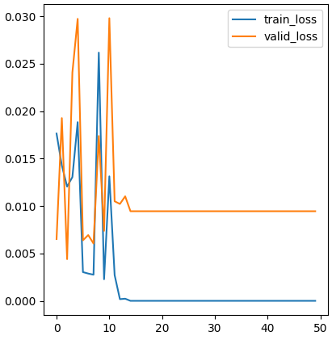 | 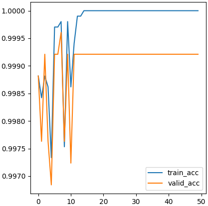 |      99.92% （eopch3）      |
|   10   | 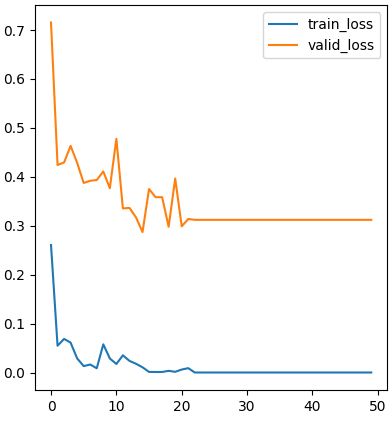 | 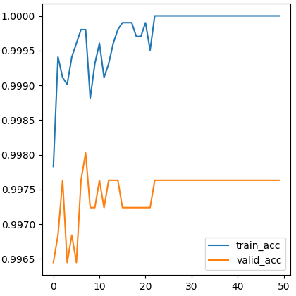 |      99.80% （epoch8）      |

从以上实验可以看到，学习率越小，收敛过程越缓慢、越稳定，但是可能会陷入局部最优解；学习率越大，收敛越快，但是收敛过程越不稳定。当学习率为 1，epoch 为 3 时验证集准确率最高。

#### 5.3.2 使用 cross-entropy loss 的线性分类模型

| 学习率 |                           损失函数                           |                            准确率                            | 验证集准确率最高值及对应的 epoch |
| :----: | :----------------------------------------------------------: | :----------------------------------------------------------: | :------------------------------: |
| 0.001  | 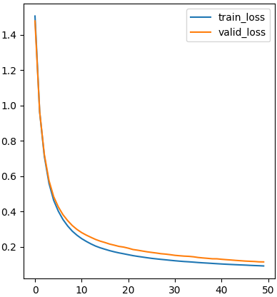 | 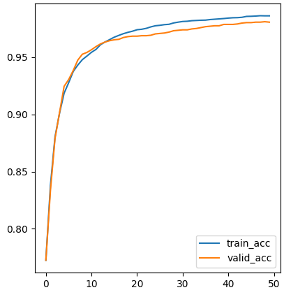 |      98.7% （epoch47）      |
|  0.01  | 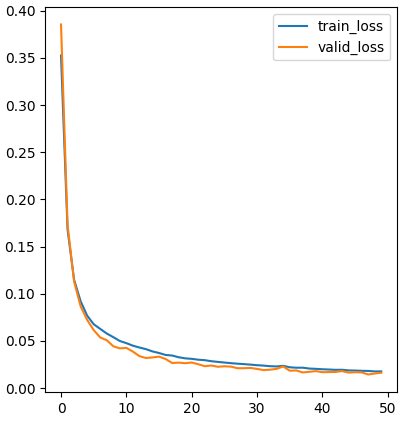 | 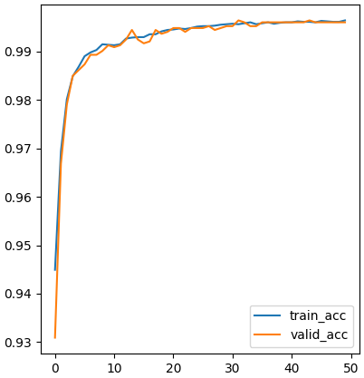 |     99.64% （eopch32）      |
|  0.1   | 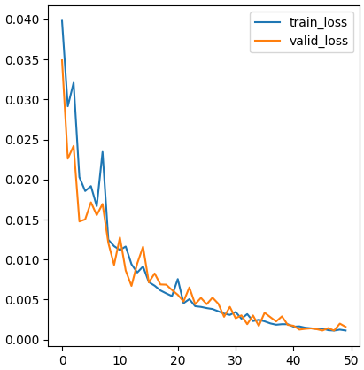 | 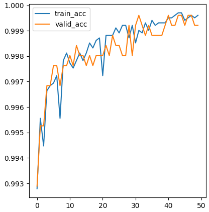 |     99.96% （epoch44）      |
|   1    | 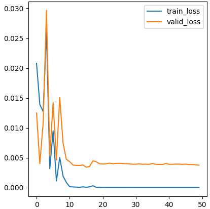 | 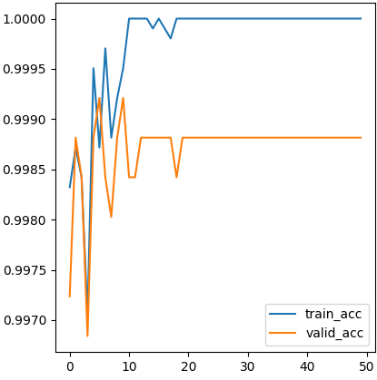 |      99.92% （epoch6）      |

当学习率为 0.1，epoch 为 44 时验证集准确率最高。

### 5.4 训练技巧

本实验的两个线性分类模型都使用小批量随机梯度下降的方法进行训练，同时在每个 epoch 利用验证集计算准确率并保留最好的模型参数。

## 6 实验结果、分析及讨论

性能总结：

|                  模型                  | 训练集准确率 | 测试集准确率 | 训练时间 |
| :------------------------------------: | :----------: | :----------: | :------: |
|     使用 hinge loss 的线性分类模型     |   100.00%    |    99.91%    | 11.85 s  |
| 使用 cross entropy loss 的线性分类模型 |    99.98%    |    99.86%    | 11.37 s  |
|          使用线性核函数的 SVM          |   100.00%    |    99.91%    |  0.48 s  |
|          使用高斯核函数的 SVM          |    99.94%    |    99.91%    |  0.96 s  |

程序输出：

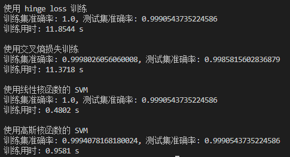

结果分析：

总的来看，由于本次实验数据比较简单，各个模型的准确率都很高，而 SVM 模型的分类准确率略高于线性分类模型。从训练时间来看，由于线性分类模型和 SVM 使用的训练代码不同，不能直接比较。而在两个线性分类模型中，使用交叉熵误差的模型训练时间短于使用 hinge loss 的模型。在两个 SVM 模型中，使用高斯核函数的模型训练时间约为使用线性核函数的模型的 2 倍，这是因为高斯核函数的计算更为复杂。

讨论：

本实验比较了使用不同损失函数的线性模型和使用不同核函数的 SVM 的性能差异。由于本次实验的数据较为简单，使用简单的 SGD 方式训练线性模型就能够得到较高的准确率。如果面对更为复杂的应用场景，可以考虑使用 Adam 等更好的参数优化方式和 Boosting 等模型集成方法来进一步提升模型性能。
