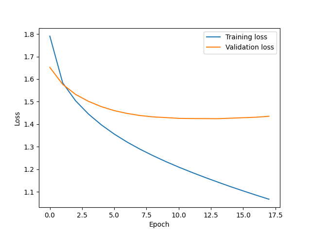

# 机器学习与数据挖掘作业 2

## 数据预处理

本次实验数据为图像数据，每张图像大小为 $32\times32\times3=3072$，每个像素的颜色值为 $[0,255]$ 的整数值。使用 `load_data()` 函数加载的数据分为训练集输入、训练集标签、测试集输入和测试机标签四个部分，输入是二维矩阵，每行有 $3072$ 个元素，标签是一个向量，每个元素是 $[0,9]$ 的整数。

我们需要将读入数据转换为 `pytorch` 张量，并且将输入数据归一化为 $[-1,1]$ 的浮点数，以下代码位于 `src/main.py`：

```
# 读取数据
X_train, Y_train, X_test, Y_test = load_data()

# 数据预处理
X_train = torch.from_numpy(X_train).float() / 255 * 2 - 1
Y_train = torch.from_numpy(Y_train).long()
X_test = torch.from_numpy(X_test).float() / 255 * 2 - 1
Y_test = torch.from_numpy(Y_test).long()
```

## 分类器

我们定义三个图像分类器：线性分类器、多层感知机和卷积神经网络。代码位于 `src/classifiers.py`。

### 线性分类器

利用 `pytorch` 框架定义模型，只需要定义继承自 `torch.nn.Module` 的类，在构造函数中定义网络的结构，然后定义 `forward()` 和 `loss()` 等方法即可：

```python
class LinearClassifier(torch.nn.Module):
    def __init__(self, input_dim, output_dim):
        super(LinearClassifier, self).__init__()
        self.linear = torch.nn.Linear(input_dim, output_dim)

    def forward(self, x):
        return self.linear(x)

    def predict(self, x):
        return torch.argmax(self.forward(x), dim=1)

    def accuracy(self, x, y):
        return torch.sum(self.predict(x) == y).item() / len(y)

    def loss(self, x, y):
        x = self.forward(x)
        return torch.nn.functional.cross_entropy(x, y)
```

注意，因为 `softmax` 函数并不会改变输出各分量的大小关系，在利用前向传播进行预测时并不需要经过 `softmax` 函数，只需找到最大输出分量对应的类别标签即可，只有在需要计算梯度时才需要经过 `softmax` 函数，这样做可以减少计算量。而 `torch.nn.functional.cross_entropy` 中已经包含了 `softmax` 函数的计算。

### 多层感知机

我们用一个 `torch.nn.ModuleList` 对象来容纳全连接层，这样我们可以方便地定义指定层数的 MLP。代码如下：

```python
class MLPClassifier(torch.nn.Module):
    def __init__(self, input_dim, output_dim, hidden_dim=100, num_hidden=1):
        super(MLPClassifier, self).__init__()
        self.num_hidden = num_hidden
        self.layers = torch.nn.ModuleList()
        self.layers.append(torch.nn.Linear(input_dim, hidden_dim))
        for i in range(num_hidden - 1):
            self.layers.append(torch.nn.Linear(hidden_dim, hidden_dim))
        self.layers.append(torch.nn.Linear(hidden_dim, output_dim))

    def forward(self, x):
        for i in range(self.num_hidden):
            x = self.layers[i](x)
            x = torch.nn.functional.relu(x)
        x = self.layers[self.num_hidden](x)
        return x

    def predict(self, x):
        return torch.argmax(self.forward(x), dim=1)

    def accuracy(self, x, y):
        return torch.sum(self.predict(x) == y).item() / len(y)

    def loss(self, x, y):
        x = self.forward(x)
        return torch.nn.functional.cross_entropy(x, y)
```

### 卷积神经网络

我们分别用一个 `torch.nn.ModuleList` 对象来容纳卷积-池化层和全连接层，代码如下：

```python
class CNNClassifier(torch.nn.Module):
    def __init__(self, output_dim):
        super(CNNClassifier, self).__init__()
        self.conv_layers = torch.nn.ModuleList(
            [
                torch.nn.Conv2d(3, 6, kernel_size=5, stride=1, padding=0),
                torch.nn.ReLU(),
                torch.nn.MaxPool2d(kernel_size=2, stride=2, padding=0),
                torch.nn.Conv2d(6, 16, kernel_size=5, stride=1, padding=0),
                torch.nn.ReLU(),
                torch.nn.MaxPool2d(kernel_size=2, stride=2, padding=0),
            ]
        )
        self.fc_layers = torch.nn.ModuleList(
            [
                torch.nn.Linear(16 * 5 * 5, 120),
                torch.nn.ReLU(),
                torch.nn.Linear(120, 84),
                torch.nn.ReLU(),
                torch.nn.Linear(84, output_dim),
            ]
        )

    def forward(self, x):
        x = x.view(-1, 3, 32, 32)
        for layer in self.conv_layers:
            x = layer(x)
        x = x.view(-1, 16 * 5 * 5)
        for layer in self.fc_layers:
            x = layer(x)
        return x

    def predict(self, x):
        return torch.argmax(self.forward(x), dim=1)

    def accuracy(self, x, y):
        return torch.sum(self.predict(x) == y).item() / len(y)

    def loss(self, x, y):
        x = self.forward(x)
        return torch.nn.functional.cross_entropy(x, y)
```

## 优化器

在 pytorch 中我们可以直接调用 SGD、Momentum 和 Adam 优化器，下面分析它们的参数更新策略。

### SGD

* 参数更新策略如下：

  $$
  boldsymbol{w}_{t+1}=\boldsymbol{w}_{t}-l r \cdot \nabla f\left(\boldsymbol{w}_{t}\right)
  $$

  其中，$\boldsymbol{w}$ 为待优化的参数，$\nabla f(\cdot)$ 是损失 $\mathcal{L}$ 的随机梯度，$lr$ 是学习率。
* SGD 存在的问题

  * 非常容易陷入局部最优解
  * 神经网络的**病态弯曲**导致收敛缓慢

### Momentum

* 参数更新公式

	$$
	\begin{array}{c}
	\boldsymbol{v}_{t}=\rho \boldsymbol{v}_{t-1}+\nabla f\left(\boldsymbol{w}_{t}\right) \\
	\boldsymbol{w}_{t+1}=\boldsymbol{w}_{t}-\operatorname{lr} * \boldsymbol{v}_{t}
	\end{array}
	$$

	其中，$\rho\in(0,1)$ 是衰减率，经常选择 0.9、0.95、0.99。

* 更新过程可以理解为一个小球从崎岖的山坡上滚下，摩擦强度与 $\rho$ 成正比。

### Adam

* 参数更新公式

	$$
	\begin{array}{l}
	m_{t}=\beta_{1} * m_{t-1}+\left(1-\beta_{1}\right) \nabla f\left(w_{t}\right) \\
	\boldsymbol{s}_{t}=\beta_{2} * \boldsymbol{s}_{t-1}+\left(1-\beta_{2}\right)\left(\nabla f\left(\boldsymbol{w}_{t}\right)\right)^{2} \\
	\boldsymbol{w}_{t+1}=\boldsymbol{w}_{t}-l r \cdot \boldsymbol{m}_{t} \oslash \sqrt{\boldsymbol{s}_{t}}
	\end{array}
	$$

	其中 $\boldsymbol{m}_t$ 是过往梯度的移动平均。
	
* 避免了神经网络的病态弯曲导致收敛缓慢的问题，加快了收敛速度。

## 训练器

我们定义一个通用的训练器来训练以上三个分类器。它将训练集切分出 ${1\over 4}$ 作为验证集，在训练时使用 mini-batch 和 early-stop 策略，当验证集损失连续 `pacient` 个 Epoch 没有下降时，停止训练。它在每个 Epoch 保存最好的模型，最后加载最优模型进行测试。

代码位于 `src/trainer.py`：

```python
def trainer(
    model,
    x_train,
    y_train,
    x_test,
    y_test,
    batch_size=32,
    epochs=1000,
    pacient=4,
    lr=1e-3,
    optimizer="SGD",
    model_path="best_model.pt",
    plot_path="loss.png"
):
    """
    训练模型
    :param model: 模型
    :param x_train: 训练集输入
    :param y_train: 训练集标签
    :param x_test: 测试集输入
    :param y_test: 测试集标签
    :param batch_size: 批大小
    :param epochs: 迭代次数
    :param pacient: 提前停止的容忍度，连续 pacient 次的验证集损失没有下降则停止训练
    :param lr: 学习率
    :param optimizer: 优化器，可选择 "SGD"、"Momentum" 或 "Adam"
    :param model_path: 模型保存路径
    :param plot_path: 图像保存路径
    """
    # 打印超参数
    print(f"Model: {type(model).__name__}")
    print(f"Batch size: {batch_size}, Epochs: {epochs}, Pacient: {pacient}, Learning rate: {lr}, Optimizer: {optimizer}")

    # 打乱输入
    print("Processing Data")
    index = np.arange(len(x_train))
    np.random.shuffle(index)
    x_train = x_train[index]
    y_train = y_train[index]

    # 切分训练集和验证集
    train_x = x_train[: int(len(x_train) * 0.8)]
    train_y = y_train[: int(len(y_train) * 0.8)]
    val_x = x_train[int(len(x_train) * 0.8) :]
    val_y = y_train[int(len(y_train) * 0.8) :]

    # 选择优化器
    if optimizer == "SGD":
        optimizer = torch.optim.SGD(model.parameters(), lr=lr)
    elif optimizer == "Momentum":
        optimizer = torch.optim.SGD(model.parameters(), lr=lr, momentum=0.9)
    elif optimizer == "Adam":
        optimizer = torch.optim.Adam(model.parameters(), lr=lr)
    else:
        raise ValueError("optimizer must be one of SGD, Momentum or Adam")

    start_time = time.time()
    train_loss = []
    val_loss = []
    best_val_loss = float("inf")
    pacient_count = 0
    print("Start Training")
    for epoch in range(epochs):
        print(f"Epoch {epoch + 1}/{epochs}")
        # 训练
        total_loss = 0
        for i in range(0, len(train_x), batch_size):
            batch_x = train_x[i : i + batch_size]
            batch_y = train_y[i : i + batch_size]
            optimizer.zero_grad()
            loss = model.loss(batch_x, batch_y)
            total_loss += loss.item() * len(batch_x)
            loss.backward()
            optimizer.step()
        train_loss.append(total_loss / len(train_x))
        print(f"\tTraining loss: {train_loss[-1]}")
        # 验证
        with torch.no_grad():
            loss = model.loss(val_x, val_y).item()
            val_loss.append(loss)
            print(f"\tValidation loss: {val_loss[-1]}")
            # 保存最好的模型
            if loss < best_val_loss:
                best_val_loss = loss
                torch.save(model.state_dict(), model_path)
                pacient_count = 0
                print("\tBest model saved!")
            else:
                pacient_count += 1
                if pacient_count == pacient:
                    print("\tEarly stopping!")
                    break
    print(f"Training finished in {time.time() - start_time}s")

    # 绘制损失曲线
    plt.figure()
    plt.plot(train_loss, label="Training loss")
    plt.plot(val_loss, label="Validation loss")
    plt.xlabel("Epoch")
    plt.ylabel("Loss")
    plt.legend()
    plt.savefig(plot_path)

    with toch.no_grad():
        # 加载最好的模型
        model.load_state_dict(torch.load(model_path))
        print("Best model loaded!")

        # 测试
        print("Start Testing")
        model.eval()
        test_acc = model.accuracy(x_test, y_test)
        print(f"Test set accuracy: {test_acc * 100}%")
```

## 实验

由于批大小和学习率不是本次实验的主要内容，下面实验统一将批大小设为 32，学习率设为 0.0001。

### 优化算法

我们先对比 SGD、SGD Momentum 和 Adam 三种优化算法对模型训练速度和性能的影响，确定最优算法用于后续实验。本实验中批大小设为 32，学习率为0.0001。

| 优化算法   | SGD                                                                         | Momentum                                                                  | Adam                                                                     |
| ---------- | --------------------------------------------------------------------------- | ------------------------------------------------------------------------- | ------------------------------------------------------------------------ |
| 线性分类器 | 收敛需要 581 个 epoch<br />训练用时 4000.50 s<br />测试集准确率为 41.09 %   | 收敛需要 56 个 epoch<br />训练用时 45.62 s<br />测试集准确率为 40.99 %    | 收敛需要 17 个 epoch<br />训练用时 21.37 s<br />测试集准确率为 40.30 %  |
| MLP 分类器 | 1000 个 epoch 仍未收敛<br />训练用时 1080.54 s<br />测试集准确率为 51.58 %  | 收敛需要 121 个 epoch<br />训练用时 176.30 s<br />测试集准确率为 50.72 % | 收敛需要15 个 epoch<br />训练用时 31.58 s<br />测试集准确率为 50.19 %    |
| CNN 分类器 | 1000 个 epoch 仍未收敛<br />训练用时 2338.97 s<br />测试集准确率为 58.64 % | 收敛需要 160 个 epoch<br />训练用时 447.29 s<br />测试集准确率为 61.06 %  | 收敛需要 50 个 epoch<br />训练用时 217.76 s<br />测试集准确率为 60.26 % |

由以上对比试验可知，SGD 优化器虽然在这三种分类器中能收敛到一个较好的结果，但是训练耗时远高于另外两个模型；Momentum 训练耗时和训练出的模型性能中等；Adam 虽然训练出的模型性能略差于另外两种优化器，但是大大减少了训练耗时。在后续的实验中，我们使用 Adam 优化器。

### 线性分类器

#### 最佳模型

* 收敛需要 17 个 epoch
* 训练用时 21.37 s
* 测试集准确率为 40.30 %
* 损失下降曲线
  

### 多层感知机

#### 超参数设置

* 批大小：32
* 学习率：0.0001

#### 隐藏层数量

| 隐藏层数量                  | 1                                                                                                                                                                                               | 2                                  | 4                                  | 8                                  | 16                                  |
| --------------------------- | ----------------------------------------------------------------------------------------------------------------------------------------------------------------------------------------------- | ---------------------------------- | ---------------------------------- | ---------------------------------- | ----------------------------------- |
| **收敛所需 epoch 数** | 15                                                                                                                                                                                              | 13                                 | 11                                 | 11                                 | 22                                  |
| **训练时间**          | 31.58 s                                                                                                                                                                                         | 35.67 s                            | 54.31 s                            | 84.07 s                            | 225.77 s                            |
| **测试集准确率**      | 50.19 %                                                                                                                                                                                         | 51.36%                             | 51.43%                             | 47.21 %                            | 43.25 %                             |
| **损失下降曲线**      |  |  |  |  |  |

从以上对比试验可知，随着隐藏层数量增加，训练时间也随之增加，但是测试集准确率先升后降，这是因为层数越多，模型越复杂，分类能力也越强，但层数过多是很容易发生过拟合，导致测试集上分类效果下降。当隐藏层数量为 4 时，测试集准确率最高。后面的实验中将隐藏层数量设为 4。

#### 隐藏层大小

| 隐藏层神经元数量            | 100                                | 200                                 | 400                                                                                                                                                                                                | 600                                 |
| --------------------------- | ---------------------------------- | ----------------------------------- | -------------------------------------------------------------------------------------------------------------------------------------------------------------------------------------------------- | ----------------------------------- |
| **收敛所需 epoch 数** | 11                                 | 7                                   | 5                                                                                                                                                                                                  | 4                                   |
| **训练时间**          | 54.31 s                            | 35.16 s                             | 30.07 s                                                                                                                                                                                            | 25.81 s                             |
| **测试集准确率**      | 51.43 %                            | 51.87 %                             | 53.14 %                                                                                                                                                                                            | 52.09 %                             |
| **损失下降曲线**      |  |  |  |  |

从以上对比试验可知，随着隐藏层神经元数量增加，测试集准确率先升后降，这是因为模型越复杂，分类能力也越强，但层数过多是很容易发生过拟合，导致测试集上分类效果下降，这点从隐藏层大小越大时验证集损失曲线尾端上翘越明显也可以看出。当隐藏层神经元数量为 400 时，测试集准确率最高。

#### 最佳模型

* 隐藏层数量：4
* 隐藏层神经元数量：400
* 收敛所需 epoch 数：5
* 训练时间：30.07 s
* 测试集准确率：53.14 %
* 损失下降曲线：
  

### 卷积神经网络

#### 超参数设置

* 2 个卷积层
  * 卷积核数量：6、16
  * 核大小：5
  * 步长：1
  * 填充：0
* 2 个池化层
  * 池化类型：最大值池化
  * 核大小：2
  * 步长：2
  * 填充：0
* 3 个全连接层
  * 神经元数量：120、84、10

#### 卷积层数

| 卷积层数量                  | 2                                | 4                                  | 6                                  | 8                                  |
| --------------------------- | -------------------------------- | ---------------------------------- | ---------------------------------- | ---------------------------------- |
| **收敛所需 epoch 数** | 50                               | 59                                 | 56                                 | 44                                 |
| **训练时间**          | 217.76 s                         | 330.97 s                           | 367.24 s                           | 349.37 s                           |
| **测试集准确率**      | 60.26 %                          | 64.19 %                            | 64.36 %                            | 62.51 %                            |
| **损失下降曲线**      |  |  |  |  |

更深的卷积层往往能够提取出更加抽象的特征信息，有助于分类器的分类，但是随着模型参数变多，也更容易发生过拟合。由以上实验可知，当卷积层数量为 6 时分类器性能最优，因此以下实验卷积层数量设为 6。

#### 滤波器数量

为了使卷积-池化层的最终输出能够与全连接层匹配，以下实验只改变前 5 层的滤波器数量而保持最后一层滤波器数量为 16。

| 滤波器数量                  | 6                                  | 16                                                                                                                                                                                                | 32                                  | 64                                  |
| --------------------------- | ---------------------------------- | ------------------------------------------------------------------------------------------------------------------------------------------------------------------------------------------------- | ----------------------------------- | ----------------------------------- |
| **收敛所需 epoch 数** | 69                                 | 56                                                                                                                                                                                                | 22                                  | 7                                   |
| **训练时间**          | 468.17 s                           | 367.24 s                                                                                                                                                                                          | 157.49 s                            | 74.14 s                             |
| **测试集准确率**      | 58.15 %                            | 64.36 %                                                                                                                                                                                           | 67.90 %                             | 65.76 %                             |
| **损失下降曲线**      |  |  |  |  |

不同的卷积核可用于提取不同图像信息，卷积核越多，越能提取出更多维度的信息。但是同样地，参数越多，模型越复杂，越可能发生过拟合。由以上实验可知，当卷积核数量为 32 时分类器性能最优，因此以下实验卷积核数量设为 32。

#### 池化的使用

| 有无池化                    | 有                                                                                                                                                                                                 | 无                                     |
| --------------------------- | -------------------------------------------------------------------------------------------------------------------------------------------------------------------------------------------------- | -------------------------------------- |
| **收敛所需 epoch 数** | 22                                                                                                                                                                                                 | 25                                     |
| **训练时间**          | 157.49 s                                                                                                                                                                                           | 165.57 s                               |
| **测试集准确率**      | 67.90 %                                                                                                                                                                                            | 60.13 %                                |
| **损失下降曲线**      |  |  |

使用池化一方面能够对抗部分噪声的干扰，提高模型的鲁棒性，另一方面能够减少物体在图像中的位置对模型决策的干扰，提高模型的泛化能力。从实验结果可以看出，使用池化能够给模型性能带来较大的提升。

### ResNet

为了进一步提升 CNN 模型的性能，我们可以增加更多的卷积层，并且采用残差网络来抑制梯度消失。采用 ResNet34 进行实验。

### 分类器比较

| 分类器                      | 线性分类器 | 多层感知机 | 卷积神经网络 | ResNet   |
| --------------------------- | ---------- | ---------- | ------------ | -------- |
| **收敛所需 epoch 数** | 17         | 5          | 22           | 2        |
| **训练时间**          | 21.37 s    | 30.07 s    | 157.49 s     | 244.03 s |
| **测试集准确率**      | 40.30 %    | 53.14 %    | 67.90 %      | 77.04 % |

在 CIFAR-10 图像分类任务上，卷积神经网络性能最优，因为它能够充分利用图像中的二维信息；多层感知机性能次优，因为它将图像所有通道的所有像素等同看待，无法利用像素之间的位置信息；而线性分类器性能最差，因为它不仅无法利用像素之间的位置信息，并且假设数据是线性可分的。采用残差网络并增加卷积层数后，模型性能可进一步提升。
